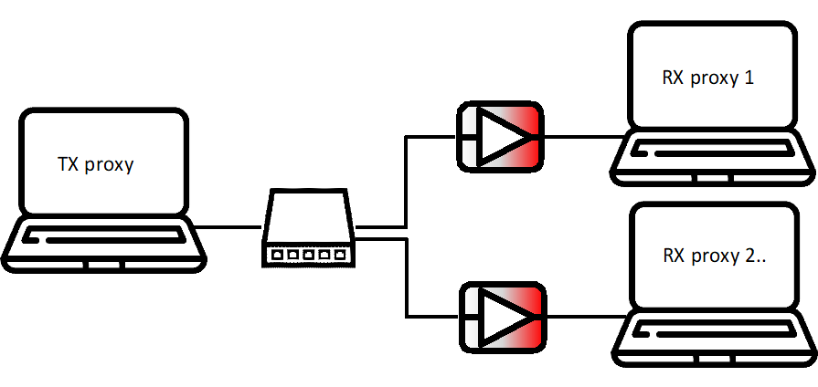
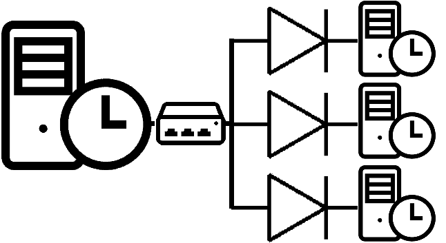
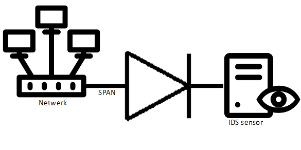
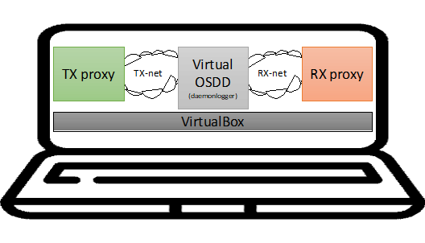

# Example datadiode setups

## Basic setup

## 2 way uni-directional setup

To be able to send and receive data via seperate interfaces causing a protocol break for most network attacks. This setup also provides control over the received and send data.
In this expample we send an OpenSSL certificate request trough the diode to be signed by the CA. After signing the CA sends the signed certificate trough the second datadiode back to the sender.

## One proxy to many destionations

Since we are using one way communication it's also possible to use multiple datadiodes and destionations using a switch.

## NTP distribution to multiple stand alone networks

This example shows an example to distribute NTP to multiple networks. Note that this configuration does not support NTPv4 folley's.

## Garanteed one way span poort to IDS

In this example we prevent the IDS to connect back to the switch via the SPAN port.

## Virtual datadiode

For simple testing on one machine its possible to create a simple Ubuntu VM with 2 interfaces connected to separate local networks.
Using the application daemonlogger it is possible to forward all packets from the first interface to the second.

